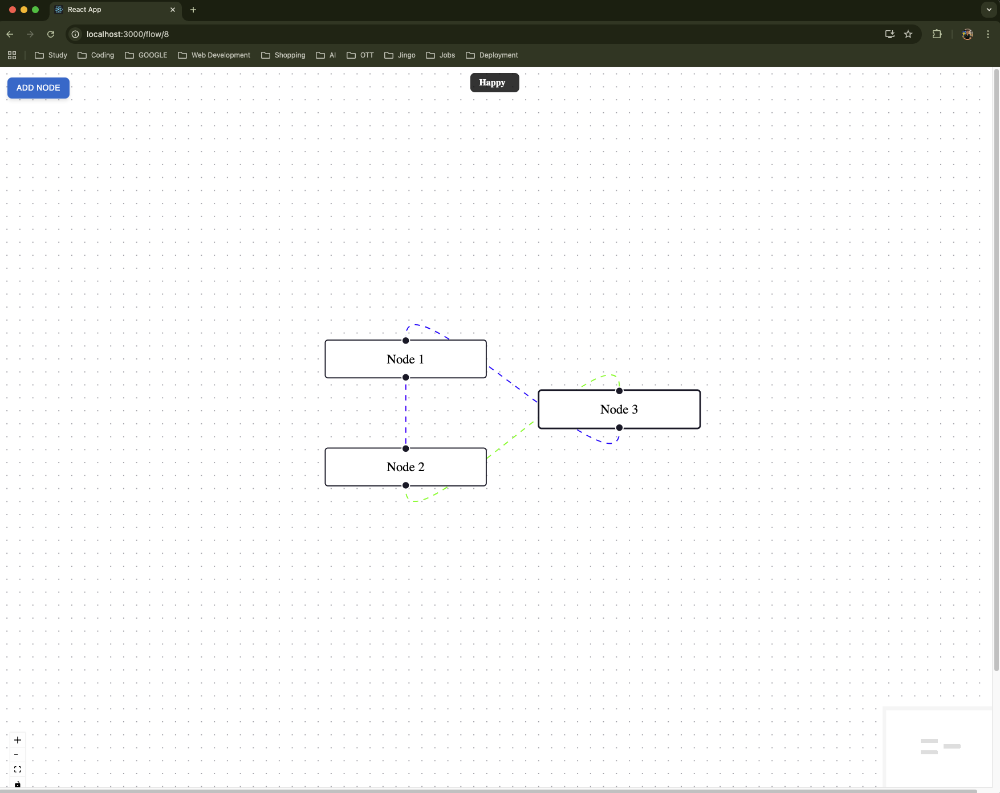

# Flowchart Management System

This project is a Django-based backend application that provides RESTful APIs to manage flowcharts consisting of nodes and edges. It supports basic CRUD operations as well as additional features like graph validation and querying connected nodes.



## Features

### Core Features
- **Create Flowchart**: Create a new flowchart with nodes and edges.
- **Fetch Flowchart**: Retrieve details of a flowchart by its ID, including its nodes and edges.
- **Update Flowchart**: Add or remove nodes and edges in an existing flowchart.
- **Delete Flowchart**: Delete an existing flowchart by its ID.

### Additional Features
- **Validate Graph**: Validate the structure of the graph (e.g., check for invalid edges).
- **Fetch Outgoing Edges**: Retrieve all outgoing edges for a given node.
- **Fetch Connected Nodes**: Retrieve all nodes directly or indirectly connected to a specific node.

## Technologies Used
- **Django**: Backend framework
- **Django REST Framework (DRF)**: For building APIs
- **SQLite**: Default database (can be replaced with PostgreSQL or MySQL)
- **Docker**: For containerized deployment

## Installation

### Prerequisites
- Python 3.8+
- Virtual Environment (optional but recommended)

### Steps
1. Clone the repository:
   ```bash
   git clone https://github.com/your-repo/flowchart-management.git
   cd flowchart-management
   ```

2. Set up a virtual environment:
   ```bash
   python -m venv venv
   source venv/bin/activate  # On Windows: venv\Scripts\activate
   ```

3. Install dependencies:
   ```bash
   pip install -r requirements.txt
   ```

4. Run migrations:
   ```bash
   python manage.py migrate
   ```

5. Start the development server:
   ```bash
   python manage.py runserver
   ```

6. Access the API at: `http://127.0.0.1:8000/api/`

### Admin Panel
1. Create a superuser:
   ```bash
   python manage.py createsuperuser
   ```
2. Access the admin panel at: `http://127.0.0.1:8000/admin/`

## API Endpoints

**Swagger Documentation** `http://127.0.0.1:8000/swagger/`

